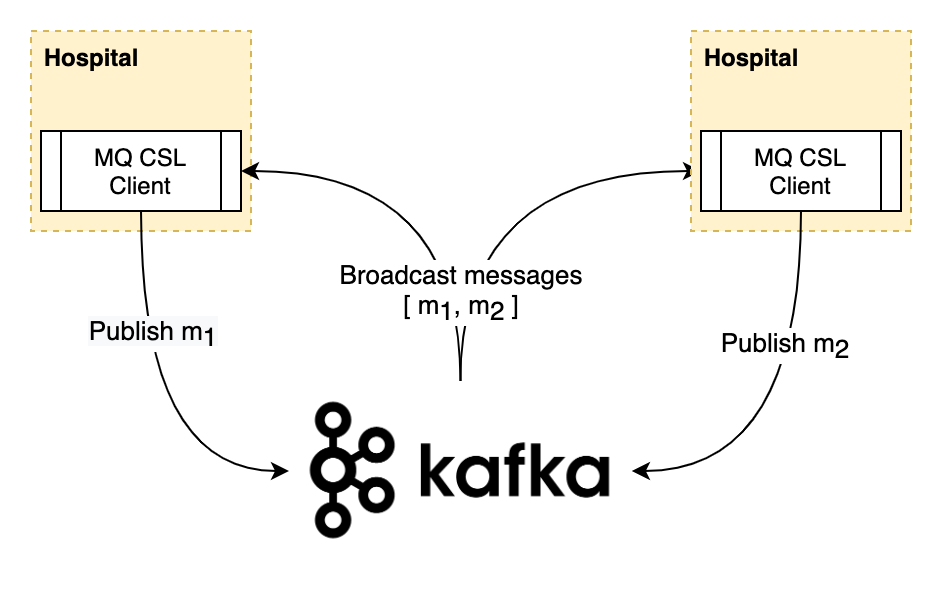
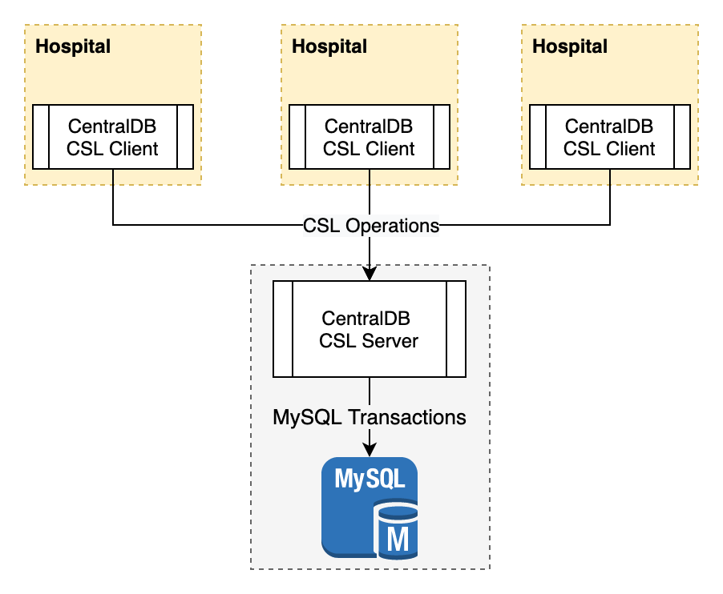

Developers: [Ankita Sharma](https://github.com/ankitasharma1), [Irvin Lim](https://github.com/irvinlim/), [James Rolfe](https://github.com/jnrolfe)

# Consistent Storage Between Mutual Distrustful Parties

A **Hospital Record Management System (HRMS)** to improve the current state intervention in the US called [Prescription Drug Monitoring Programs (PDMPs)](https://www.cdc.gov/drugoverdose/pdmp/states.html). This application is built using a microservice architecture with 3 different consistent storage layer (CSL) solutions that can be toggled. The 3 CSL solutions entail a blockchain ([BigchainDB](https://www.bigchaindb.com/)), a message queue ([Apache Kafka](https://kafka.apache.org/)), and a central RDBMS ([InnoDB MySQL](https://dev.mysql.com/doc/refman/8.0/en/innodb-storage-engine.html)).

## Screenshots

<p align="center">
  
  
  
</p>

## Service Architecture

Our HRMS is composed of many microservices written in different languages that talk to each other using [Nameko](https://github.com/nameko/nameko) (our main microservice framework for implementing RPC servers).

Patients can `REGISTER` with at most 1 hospital at a time, `READ` and `TRANSFER` their medical records, and can `UNREGISTER` from our ecosystem. Physicians can `REGISTER` with many hospitals and can `READ` and `WRITE` medical records for a patient if given consent by the patient i.e. the patient has provided their card which contains their personal credentials.

<p align="center">
  
</p>

The following is a list of core services that will be deployed in each hospital. We expect that these microservices will have full access to each other within a private network.

| Service                                         | Language    | Description                                                            |
| ----------------------------------------------- | ----------- | ---------------------------------------------------------------------- |
| Frontend (`frontend`)                           | HTML/CSS/JS | UI for patients and physicians                                         |
| API Gateway (`api_gateway`)                     | Python      | Entrypoint. Funnels requests to patient/physician services             |
| Patient Service (`patient_service`)             | Python      | Handles business logic for patient requests                            |
| Physician Service (`physician_service`)         | Python      | Handles business logic for physician requests                          |
| Discovery Service (`discovery_service`)         | Go          | Acts as service discovery and key management service for the hospitals |
| Consistent Storage Proxy (`consistent_storage`) | Python      | Server that proxies consistent storage operations to the CSL backend   |
| MQ Client (`sagas`)                             | Go          | Server that provides the MQ CSL interface                              |
| Central DB Server (`centraldb`)                 | Go          | Server that provides the RDBMS CSL interface                           |
| BigchainDB Client (`bigchaindb_client`)         | Python      | Server that provides the BigchainDB CSL interface                      |

Other auxiliary services located within each hospital include:

| Service         | Purpose                                                                                                                        |
| --------------- | ------------------------------------------------------------------------------------------------------------------------------ |
| `rabbitmq`      | RabbitMQ server, which provides the data plane for the AMQP protocol, used by Nameko services                                  |
| `local_storage` | Redis server for storing encrypted medical records, or other data that does not need consistent inter-hospital synchronization |

The rest of the services are deployed centrally, where all hospitals will connect via an overlay network to the necessary centralized service. Services that do not define a network below means that hospitals do not have direct access to them.

| Namespace             | Service             | Hospital Overlay Network  | Purpose                                                                                                                                                                                                                                                                                                                                                    |
| --------------------- | ------------------- | ------------------------- | ---------------------------------------------------------------------------------------------------------------------------------------------------------------------------------------------------------------------------------------------------------------------------------------------------------------------------------------------------------- |
| `cs2952f-sagas`       | `kafka`             | `hrms-hospital-sagas`     | Kafka server that all hospital `sagas` services will communicate with                                                                                                                                                                                                                                                                                      |
| `cs2952f-sagas`       | `zookeeper`         | -                         | Used by `cs2952f-sagas_kafka` as its backing datastore                                                                                                                                                                                                                                                                                                     |
| `cs2952f-centraldb`   | `centraldb`         | `hrms-hospital-centraldb` | gRPC server for providing the RDBMS CSL                                                                                                                                                                                                                                                                                                                    |
| `cs2952f-centraldb`   | `mysql`             | -                         | Used by `cs2952f-centraldb_centraldb` as its backing datastore                                                                                                                                                                                                                                                                                             |
| `cs2952f-bigchain`    | `bigchaindb`        | `hrms-hospital-bigchain`  | HTTP server for a single BigchainDB node                                                                                                                                                                                                                                                                                                                   |
| `cs2952f-bigchain`    | `tendermint`        | -                         | Consensus engine that is used by `cs2952f-bigchain_bigchaindb` to resolve and achieve consensus; it is the heart of the BigchainDB node within the bigger consortium                                                                                                                                                                                       |
| `cs2952f-bigchain`    | `mongodb`           | -                         | Local datastore for the BigchainDB node                                                                                                                                                                                                                                                                                                                    |
| `cs2952f-discovery`   | `discovery_service` | `hrms-hospital-discovery` | A non-hospital node within the discovery service mesh; simply exposes discovery service information from within the network, used by auxiliary stuff like loadtesting                                                                                                                                                                                      |
| `cs2952f-discovery`   | `zookeeper`         | `hrms-hospital-discovery` | Used for hospitals to register themselves on an inter-hospital service mesh, provides IDs, hostnames, and public key announcements. Uses [ZK ACLs](https://zookeeper.apache.org/doc/r3.1.2/zookeeperProgrammers.html#sc_ZooKeeperAccessControl) to secure its Znode, so that other hospitals cannot tamper with it as long as the (ephemeral) Znode exists |
| `cs2952f-loadtesting` | `loadtester`        | `hrms-loadtesting`        | Sidecar for injecting HTTP requests to all `consistent_storage` services discovered on the discovery service, for loadtesting and benchmarking purposes                                                                                                                                                                                                    |
| `cs2952f-loadtesting` | `loadtester_py`     | `hrms-loadtesting`        | Same thing as above, but in Python (not used due to poor performance)                                                                                                                                                                                                                                                                                      |

### MQ CSL Architecture



Each hospital runs its own `sagas` server, which participates and consumes from a single Kafka topic. Apache Kafka will help to provide a global total order over all messages, providing CSL semantics.

The `sagas` server implements the [`ConsistentStorage`](https://github.com/CSCI-2952-F/consistent-hrms/blob/master/protos/consistent_storage.proto) interface, and provides Python bindings for making the gRPC requests within the hospital private network.

Since messages published to Kafka are not authenticated, we implement a PKI-based solution to authenticate and verify the integrity of a sender.

### RDBMS CSL Architecture



The `centraldb` server is a single server that all hospitals will connect to, federating reads and writes to an InnoDB MySQL database/cluster.

The `centraldb` server implements the [`CentralConsistentStorage`](https://github.com/CSCI-2952-F/consistent-hrms/blob/master/protos/consistent_storage.proto) interface, which is a wrapper interface around `ConsistentStorage`, adding authentication and identification to the protocol.

### BigchainDB CSL Architecture

Each hospital runs its own `bigchaindb_client` server (contrary to its name), which interfaces directly with a BigchainDB consortium.

The `bigchaindb_client` server also implements the [`ConsistentStorage`](https://github.com/CSCI-2952-F/consistent-hrms/blob/master/protos/consistent_storage.proto) interface over gRPC.

The following is the architecture of a BigchainDB consortium, in which `bigchaindb_client` servers are "users".


## Instructions

### Starting up

First, run `init.sh`, which will bootstrap any necessary dependencies. This only needs to be done once, or whenever the script itself is changed.

> NOTE: You need to restart the **tendermint** container by calling `docker restart cs2952f-bigchain_tendermint_1`

A useful Python script has been included to start various hospital namespaces, orchestrated using Docker Compose. The number of namespaces started depends on the list of hospital names in `data/hospitals.txt`.

To start all hospitals, run:

```sh
python hospitals.py start
```

> _NOTE: If this is your first time running the system_ OR _you have just rebuilt the bigchaindb service_

You need to seed bigchaindb with unregistered patient assets. Run the following commands:

```sh
./preopulate.sh <num_cards> <patient_name>
```

For example:

```sh
./prepopulate.sh 1 alice
./prepopulate.sh 1 bob
./prepopulate.sh 1 charlie
```

The patient cards will be found in `src/bigchaindb_client/personal_cards/`.

If you would like to reseed bigchain, do this:

```sh
docker-compose -f docker-compose.bigchain.yml -p cs2952f-bigchain down -v
docker-compose -f docker-compose.bigchain.yml -p cs2952f-bigchain up -d --build
```

The frontend servers will be listening on the local interface, at ports starting from 8000.

A patient will need to upload their pre-allocated personal card before registering with any hospital in our ecosystem. A successful registration will result in a patient card that can be downloaded and used for that patient from that point onwards.

### Development

When making source code changes, it is necessary to rebuild the services. You can use `python hospitals.py start` to rebuild and reload just the changed services. This depends on the contents of `hospitals.txt`.

The `hospitals.py` script also provides useful aliases for working with multiple Docker Compose projects. For example, to view the running containers across all hospitals, you can use:

```sh
$ python hospitals.py ps
[*] Executing: /usr/local/bin/docker-compose -f docker-compose.hospital.yml -p rhode-island-hospital ps
                   Name                                 Command                  State                        Ports
------------------------------------------------------------------------------------------------------------------------------------
rhode-island-hospital_api_gateway_1          bash -c nameko run ${MODUL ...   Up (healthy)   127.0.0.1:8100->80/tcp
rhode-island-hospital_consistent_storage_1   nameko run consistent_stor ...   Up
rhode-island-hospital_frontend_1             python main.py                   Up             127.0.0.1:8000->80/tcp
rhode-island-hospital_patient_service_1      bash -c nameko run ${MODUL ...   Up
rhode-island-hospital_physician_service_1    bash -c nameko run ${MODUL ...   Up
rhode-island-hospital_rabbitmq_1             docker-entrypoint.sh rabbi ...   Up             25672/tcp, 4369/tcp, 5671/tcp, 5672/tcp
rhode-island-hospital_redis_1                docker-entrypoint.sh redis ...   Up             6379/tcp
rhode-island-hospital_sagas_1                sagas                            Up             8080/tcp
[*] Executing: /usr/local/bin/docker-compose -f docker-compose.hospital.yml -p miriam-hospital ps
                Name                              Command                  State                        Ports
------------------------------------------------------------------------------------------------------------------------------
miriam-hospital_api_gateway_1          bash -c nameko run ${MODUL ...   Up (healthy)   127.0.0.1:8101->80/tcp
miriam-hospital_consistent_storage_1   nameko run consistent_stor ...   Up
miriam-hospital_frontend_1             python main.py                   Up             127.0.0.1:8001->80/tcp
miriam-hospital_patient_service_1      bash -c nameko run ${MODUL ...   Up
miriam-hospital_physician_service_1    bash -c nameko run ${MODUL ...   Up
miriam-hospital_rabbitmq_1             docker-entrypoint.sh rabbi ...   Up             25672/tcp, 4369/tcp, 5671/tcp, 5672/tcp
miriam-hospital_redis_1                docker-entrypoint.sh redis ...   Up             6379/tcp
miriam-hospital_sagas_1                sagas                            Up             8080/tcp
[*] Executing: /usr/local/bin/docker-compose -f docker-compose.hospital.yml -p newport-hospital ps
                Name                               Command                  State                        Ports
-------------------------------------------------------------------------------------------------------------------------------
newport-hospital_api_gateway_1          bash -c nameko run ${MODUL ...   Up (healthy)   127.0.0.1:8102->80/tcp
newport-hospital_consistent_storage_1   nameko run consistent_stor ...   Up
newport-hospital_frontend_1             python main.py                   Up             127.0.0.1:8002->80/tcp
newport-hospital_patient_service_1      bash -c nameko run ${MODUL ...   Up
newport-hospital_physician_service_1    bash -c nameko run ${MODUL ...   Up
newport-hospital_rabbitmq_1             docker-entrypoint.sh rabbi ...   Up             25672/tcp, 4369/tcp, 5671/tcp, 5672/tcp
newport-hospital_redis_1                docker-entrypoint.sh redis ...   Up             6379/tcp
newport-hospital_sagas_1                sagas                            Up             8080/tcp
```

The list of proxied commands to Docker Compose can be found in `hospitals.py`.

To view Docker Compose information for a single hospital, use the following command syntax:

```sh
docker-compose -f <DOCKER_COMPOSE_YML> ... -p <HOSPITAL-NAME> <COMMAND>
```

To change the number of hospitals to orchestrate, modify `hospitals.txt`.

### Tearing down

To terminate all containers, use the helper script again:

```sh
python hospitals.py stop
```

## Configuration

You can specify various configuration for running different types of experiments on the architecture.

The following environment variables are used:

- `CONSISTENT_STORAGE_BACKEND`: Choose the backend used for consistent storage. Options: `sagas`, `bigchain`, `centraldb`
- `SAGAS_NUM_PARTITIONS`: Number of partitions in the Kafka topic, to increase parallelism.
  - When changing this, Kafka will probably complain. It's best to delete the topic whenever you need to change the number of partitions in order to run experiments.

You can also choose to spin up more hospitals by adding or removing lines in `data/hospitals.txt`.

## Testing

### End-to-end tests

There are several end-to-end tests for testing the correctness of CSLs and patient workflows in the `tests/` directory.

## Style Guide

### General

Use [EditorConfig](https://editorconfig.org/) to configure your IDE to respect the configuration file located in `.editorconfig`.

### Prettier

This project uses [Prettier](https://prettier.io/) to format JS, HTML, CSS and Markdown files automatically. The configuration is located in `.prettierrc`.

### Python

This project uses [Pylint](https://www.pylint.org/) and [YAPF](https://github.com/google/yapf) for linting and code formatting respectively. Configure your IDE to use the configuration files `.pylintrc` and `style.cfg` respectively.

### Go

This project uses [`go fmt`](https://golang.org/pkg/fmt/) for formatting Go code, without any custom configuration.
